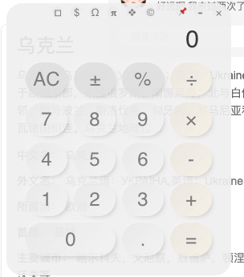
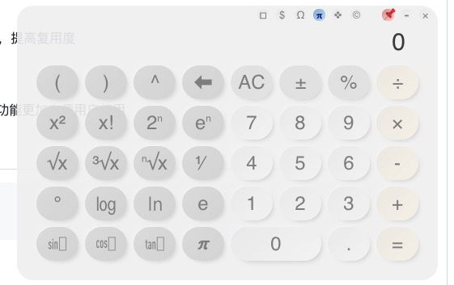

# 福报工具箱 fubaotools

## 计算器


这是一个为完成课堂作业而生的项目，使用了electron + vue + sass

### v1.0 使用说明


下载release1.0版本压缩包，打开exe

1.按键说明 0-9 +-\*÷ 对应小键盘 ，Enter 对应 = ，BackSpace 对应退格键

2.点击上方按钮切换模式，1.0 版本中物理模式还为开发完成，可以使用小钉子 pin 到桌面顶部

### v1.0 功能实现与介绍

1. 模式切换，简单、数学、物理、金融、终端五种模式切换
2. 简单模式 simple：采用中缀转后缀、后缀求值进行基本四则运算，并使用 math.js 采用字符串预处理的方式完成复杂运算
3. 数学模式 math：使用 mathjs 库进行运算，支持三角函数、对数、指数、阶乘。
4. 终端模式 terminal：使用 mathjs 进行函数、变量、基本运算，十分强大，支持变量、函数定义、矩阵运算。并存储历史数据在本地缓存中，可通过按钮删除本地存储。
5. 金融模式 finance：使用 vue 的 computed，和 moneyjs 汇率转换，默认货币为 人民币

electron 桌面端多平台打包

## 项目启动

```
npm install
npm run electron:serve
```

# fubaotools——calculator

This is a project of my homework ——a calculator application. It is built with electron + vue3 + Sass.
